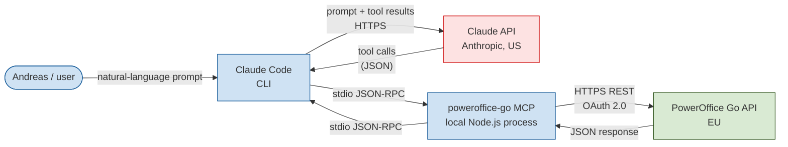
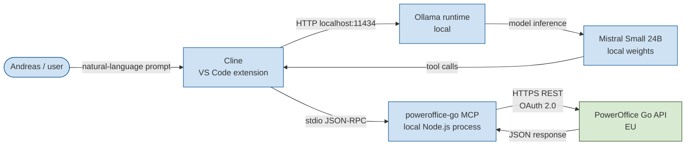

# PowerOffice Go MCP Server

[](https://github.com/smplas/poweroffice-go-mcp/actions/workflows/ci.yml)
[](https://github.com/smplas/poweroffice-go-mcp/actions/workflows/codeql.yml)

An MCP (Model Context Protocol) server that exposes a curated, **draft-only** subset of the PowerOffice Go API to AI assistants such as Claude Code, Cursor, Cline, and GitHub Copilot.

Built by [SmplCo](https://smpl.no/) for use in the demonstration at **Tech-Forum Stavanger, 4 June 2026** with [CMS Kluge Advokatfirma](https://cms.law/en/nor/). This repository is the codebase that the lawyers and audience will be reviewing.

---

## Why this exists

We wanted to find out, in public, how far a small business can take AI-assisted automation of an accounting workflow — and what the legal and practical limits actually are.

Rather than running the experiment behind closed doors and presenting a polished outcome, we built a working integration against the real PowerOffice Go API, opened up the source code, and invited Norwegian tech lawyers to stress-test it live.

---

## Design principles

The server is built around four deliberate constraints:

1. **Draft-only.** The server can create, read, update, and delete *draft* sales orders. It **cannot** send invoices, issue invoices, send payment reminders, or take any action with external effect. A human must log into PowerOffice Go's UI to do that. The relevant tools simply do not exist in the code — see [Why there is no `send_invoice`](#why-there-is-no-send_invoice).
2. **Human-in-the-loop by architecture, not by promise.** The safety guarantee is enforced by the absence of write-finalisation tools, not by a configuration flag or system prompt.
3. **Auditable by default.** Every tool call is appended to an audit log (`~/.poweroffice-mcp/audit.log`) with timestamp, tool name, arguments, outcome and duration. See [Audit logging](#audit-logging).
4. **No secrets in the repo.** Credentials are passed via environment variables. The repo is safe to share.

---

## Data flow

### Setup A — Cloud frontier model (Anthropic Claude)



What crosses the Atlantic: every user message, every tool input, and every tool output (customer names, invoice amounts, etc.) — sent to Claude so it can reason over them.

### Setup B — Local model (Mistral Small via Ollama)



What crosses the Atlantic: **nothing**. The model runs on the user's laptop. The only outbound traffic is to PowerOffice Go's EU-based API.

---

## What the server can do

A snapshot of registered tools (see `src/tools/` for the full set):

| Area | Read | Write (draft-only) |
|---|---|---|
| Customers | `list_customers`, `get_customer`, `search_customers`, `list_contact_persons` | `create_customer`, `create_contact_person`, `archive_customer`, `delete_customer` |
| Products | `list_products`, `get_product` | `create_product`, `update_product` |
| Sales orders | `list_invoices`, `get_invoice` | `create_draft_invoice`, `update_draft_invoice`, `delete_draft_invoice`, `add_invoice_attachment` |
| Outgoing invoices (sent) | `list_outgoing_invoices`, `get_outgoing_invoice` | *(none — strictly read-only)* |
| Customer ledger | `get_customer_balances`, `get_open_items`, `get_customer_statement` | *(none)* |
| Employees | `list_employees`, `get_employee` | *(none)* |
| Dimensions | `list_departments`, `list_projects` | `create_project` |
| Settings | `list_vat_codes`, `list_payment_terms`, `list_branding_themes`, `list_currencies` | *(none)* |
| Prospects | `list_customer_prospects` | `convert_prospect_to_customer` |
| Validation | `validate_invoice` | *(read-only)* |

---

## Why there is no `send_invoice`

PowerOffice Go's API supports sending invoices and other state-changing operations. We deliberately did **not** expose them as MCP tools.

The architectural choice is:

- Tools that have **no external visible effect** (drafts, internal records) are exposed.
- Tools that **create external obligations** (invoices sent to customers, payment reminders, debt collection notices) are not exposed.

A reviewer can verify this by searching the codebase for `send`, `confirm`, `issue`, `finalize` — none of those tools exist. If we wanted to add them later, it would require an explicit code change, a code review, and a deliberate redeployment.

---

## Audit logging

Every tool invocation is logged as one JSON line in `~/.poweroffice-mcp/audit.log` (configurable via the `POWEROFFICE_AUDIT_LOG` environment variable). Format:

```json
{"ts":"2026-05-27T07:14:22.118Z","tool":"create_draft_invoice","args":{"customerId":27469244,"lines":[...]},"status":"ok","durationMs":634}
```

The log records:
- Timestamp (UTC, ISO-8601)
- Tool name
- Input arguments (after Zod validation)
- Outcome (`ok` or `error`)
- Duration in milliseconds
- Error message on failure

The log is append-only from the server's side. It is **not** uploaded anywhere — it lives on the machine running the MCP server.

---

## Testing and continuous integration

The repository ships with a [Vitest](https://vitest.dev/) test suite. Run it locally with:

```bash
npm test
```

Tests cover the rate limiter, the audit log, the JSON-Patch body conversion, the URL-encoding helper, and the invoice validator. The full test suite runs on every push and pull request via [GitHub Actions](./.github/workflows/ci.yml), along with `npm audit`, `tsc`, and the `npm run build` step.

[GitHub CodeQL](./.github/workflows/codeql.yml) runs the `security-and-quality` query suite on every push, every PR, and on a weekly cron — so a vulnerability disclosed after a release will surface on the next scan even without a new commit.

[Dependabot](./.github/dependabot.yml) opens weekly PRs for npm updates and monthly PRs for GitHub Actions updates.

## Dependencies

Two runtime dependencies, both [MIT licensed](https://opensource.org/licenses/MIT):

- [`@modelcontextprotocol/sdk`](https://github.com/modelcontextprotocol/typescript-sdk) — the official MCP SDK from Anthropic
- [`zod`](https://github.com/colinhacks/zod) — schema validation

No code was copied from third-party repositories. Everything in `src/` was written for this project. All HTTP calls use the platform-native `fetch` API in Node.js 20+.

---

## Running it

```bash
git clone <this-repo>
cd PoGoMCP
npm install
npm run build

export POWEROFFICE_API_URL="https://goapi.poweroffice.net/Demo"
export POWEROFFICE_APP_KEY="..."
export POWEROFFICE_CLIENT_KEY="..."
export POWEROFFICE_SUBSCRIPTION_KEY="..."

node dist/index.js
```

To connect from Claude Code, add the following block to `~/.claude.json` under `mcpServers`:

```json
"poweroffice-go": {
  "command": "node",
  "args": ["/absolute/path/to/PoGoMCP/dist/index.js"],
  "env": {
    "POWEROFFICE_API_URL": "https://goapi.poweroffice.net/Demo",
    "POWEROFFICE_APP_KEY": "...",
    "POWEROFFICE_CLIENT_KEY": "...",
    "POWEROFFICE_SUBSCRIPTION_KEY": "..."
  }
}
```

For Cline (VS Code / Cursor), see `cline_mcp_settings.json` under the Cline extension's global storage directory.

---

## How it was built

The entire codebase was developed by Andreas Melvær (a designer, not a full-time developer) through natural-language conversation with **Claude Code (Anthropic)**, on a Claude Max plan with training-data sharing disabled.

The development process itself is part of the demonstration: how far can a non-developer take a real API integration, with current AI tooling, in a single working session?

---

## Acknowledgements

Thank you to **PowerOffice Go** for providing API access for this experiment and for being genuinely open to customers and partners building on top of their platform.

Thank you to **CMS Kluge Advokatfirma**, in particular Ove André Vanebo and Bernt Olav Thorsheim, for agreeing to scrutinise this in public.

---

## License

MIT — see [LICENSE](./LICENSE).

This code is provided for educational and demonstrative purposes. It is not a production-ready integration and should not be deployed against live financial data without independent review.
